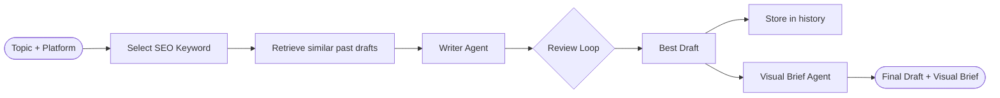
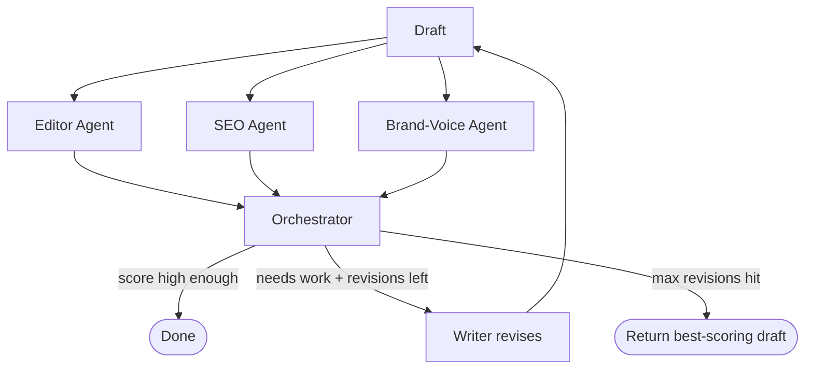

# AI Content Marketing Assistant

A local, multi-agent AI system that writes, reviews, and refines marketing content (blog posts, LinkedIn posts, Instagram captions) — built entirely on **Ollama** (no OpenAI/cloud LLM dependency), as a hands-on learning project covering agentic AI concepts: harness design, agent loops, multi-agent orchestration, RAG, and multimodal reasoning. Exposed via a **FastAPI** endpoint for programmatic access.

## What it does

Given a topic and target platform, the system:
1. Selects an SEO keyword for the topic
2. Retrieves similar past drafts (RAG) as style reference
3. Writes a first draft, tailored to the platform's format (blog / LinkedIn / Instagram)
4. Runs the draft through three specialist reviewers in parallel:
   - **Editor** — general clarity and coherence
   - **SEO Agent** — keyword density and readability, using real computed metrics (not LLM guesswork)
   - **Brand-Voice Agent** — tone/style guidelines, retrieved via RAG
5. An **Orchestrator** combines the three verdicts into a percentage score and, if needed, synthesizes one prioritized revision note
6. Loops draft → review → revise until the score is high enough or a revision cap is hit — always returning the **best-scoring draft seen**, not just the last one produced
7. Generates a **Visual Brief** (concept, style, colors, composition) for an accompanying image
8. Stores the final draft in a vector database for future retrieval on similar topics

## Architecture

**Overall pipeline**



**Inside the review loop**



**Folder structure**

```
main.py                        — thin CLI entry point
api.py                         — FastAPI app (POST /generate)
core/
  pipeline.py                  — run_content_loop(), shared by main.py and api.py
harness/
  state.py                     — tracks drafts, revision count, best-scoring draft
  config.py                    — model name, max revisions, platform SEO thresholds
agents/
  blog_writer.py                — drafts content, platform-aware
  editor.py                     — general quality review
  seo_agent.py                  — hybrid rule-based + LLM SEO review, keyword selection
  brand_voice_agent.py          — RAG-backed brand guideline review
  orchestrator.py               — combines specialist verdicts, synthesizes feedback
  visual_brief_agent.py         — generates a text visual brief (see note below)
tools/
  brand_guidelines_store.py     — ChromaDB store for brand guidelines (RAG)
  content_history_store.py      — ChromaDB store for past drafts (RAG)
```

## Key design decisions (and why)

- **Harness vs. agents, separated deliberately** — `harness/` holds pure state/config with no AI calls; `agents/` holds anything that calls the model. This kept the control flow debuggable independently of AI behavior.
- **Deterministic code owns objective decisions; the LLM only phrases them.** SEO density/readability checks are computed with plain Python math, not LLM judgment — an early version let the LLM decide "increase vs. decrease" keyword density from the numbers, and it got the direction wrong. Moving that decision into code fixed it permanently.
- **Percentage-based verdicts instead of LLM self-scoring.** Asking the LLM for a 0-100 quality score produced inconsistent, unreliable numbers. Instead, each specialist gives a binary GOOD/NEEDS_WORK verdict (something small local models do reliably), and the Orchestrator computes a percentage from how many of the three agree — combining LLM judgment with deterministic counting.
- **Best-draft tracking, not last-draft.** An early bug: when the revision loop hit its cap, it returned whichever draft ran *last*, even if an earlier draft had scored better. Fixed by having the harness track the highest-scoring draft throughout the loop.
- **RAG is a good fit for style examples, a poor fit for style *rules*.** Retrieving similar past drafts (topic-to-topic comparison) works well semantically. Retrieving brand guideline sentences against a whole draft's embedding was tried first and found to be a weaker match — granularity mismatch between a single-sentence rule and a multi-paragraph draft's embedding.
- **Image generation → visual brief, not real pixels.** Local Stable Diffusion was attempted but hit an unresolvable dependency conflict on Intel Mac (PyTorch capped at 2.2.2, incompatible with current `diffusers`/`huggingface_hub`/`transformers`). Pivoted to an LLM-generated visual brief (concept, style, palette, composition) — stays 100% Ollama-based and still exercises multimodal *reasoning*, just not image rendering.
- **Persistent, not in-memory, vector storage.** The first RAG implementation used an in-memory Chroma client, which silently lost all stored drafts between script runs. Switched to `PersistentClient` so retrieval actually works across separate runs.
- **Pipeline logic separated from entry points.** The core loop lives in `core/pipeline.py`, imported by both `main.py` (CLI) and `api.py` (FastAPI server) — neither entry point duplicates the logic, and adding a new interface later just means writing a new thin wrapper.

## Concepts covered

Agentic loop · harness design · multi-agent orchestration · RAG (retrieval-augmented generation) · hybrid rule-based + LLM decision-making · multimodal reasoning · platform-aware prompt engineering · local LLM serving via Ollama · REST API design with FastAPI

## Setup

```bash
# 1. Install and start Ollama, pull models
ollama pull llama3.2
ollama pull nomic-embed-text

# 2. Python environment
python3 -m venv venv
source venv/bin/activate
pip install -r requirements.txt

# 3. Run via CLI
python3 main.py

# 4. Or run via API
uvicorn api:app --reload
```

## API usage

Once running (`uvicorn api:app --reload`), interactive docs are available at `http://127.0.0.1:8000/docs`.

**Example request:**

```bash
curl -X POST http://127.0.0.1:8000/generate \
  -H "Content-Type: application/json" \
  -d '{
    "topic": "harness engineering in AI agents",
    "platform": "linkedin"
  }' \
  | python3 -m json.tool
```

**Response shape:**

```json
{
  "draft": "...",
  "score": 100,
  "revisions": 2,
  "visual_brief": {
    "concept": "...",
    "style": "...",
    "colors": "...",
    "composition": "..."
  },
  "keyword": "..."
}
```

Note: a full pipeline run involves multiple LLM calls (keyword selection, drafting, three specialist reviews, possible revisions, visual brief) on CPU — expect noticeably longer response times than a typical API call.

## How I built this — debugging log

A few of the real problems hit during development, since working through these was as much the point as the final result:

- **Keyword-density direction bug**: the SEO agent was given correct density metrics but told the LLM to *decide* whether to increase or decrease keyword usage — it misread its own numbers and suggested increasing density that was already too high. Fixed by moving the increase/decrease decision into plain Python (`if density > threshold`), leaving the LLM to only phrase the already-decided issue.

- **SEO keyword vs. topic conflation**: early on, the full topic sentence ("The benefits of using local LLMs for content creation") was passed as the SEO "keyword" — an 8-9 word phrase that could never hit a realistic density target without wrecking readability. Fixed by separating `topic` (what the Writer writes about) from `keyword` (a short phrase, later auto-selected by its own LLM call) as two distinct parameters.

- **SEO checking one issue at a time**: the SEO agent originally returned on the first problem it found (density *or* readability), causing the Writer to fix one issue and break the other across revisions, oscillating instead of converging. Fixed by collecting *all* issues in one pass.

- **Silent empty-feedback parsing bug**: the Orchestrator's feedback parser only captured text on the same line as the `FEEDBACK:` label. When the model put its actual answer on the *next* line, the parser silently returned an empty string. Fixed by switching from line-by-line matching to `content.split("FEEDBACK:", 1)[1]`, capturing everything after the label regardless of line breaks.

- **Local Stable Diffusion dependency chain**: attempted real image generation via `diffusers` + `torch` locally. Hit a cascading series of version conflicts — NumPy 2.x vs. compiled dependencies, `torch.xpu` missing (PyTorch stopped building for Intel Macs after 2.2.x), then a `diffusers`/`huggingface_hub` version deadlock with no mutually compatible pin. Rather than keep chasing compatible versions, pivoted to an LLM-generated visual brief instead of real pixels — same multimodal reasoning, no fragile ML dependency chain.

- **In-memory vector store losing data between runs**: RAG retrieval appeared broken — a second run couldn't find drafts stored by a previous run. Root cause: `chromadb.Client()` is in-memory only. Fixed with `chromadb.PersistentClient(path=...)` so the store survives across script executions.

- **Returning the wrong draft on revision timeout**: when the loop hit its max-revision cap, it returned whichever draft was generated *last*, even when an earlier draft had scored better. Fixed by having the harness (`ContentState`) track the highest-scoring draft throughout the loop, not just the most recent one.

## Notes

- Built and tested on CPU only (Intel Mac, no GPU) — expect each revision round to take a while.
- Not deployed; runs locally, accessible via CLI or local API server.
- If deployed, would run on AWS on a CPU instance (chosen over GPU for cost, and over Azure for stronger relevance to startup/SaaS-style engineering roles).